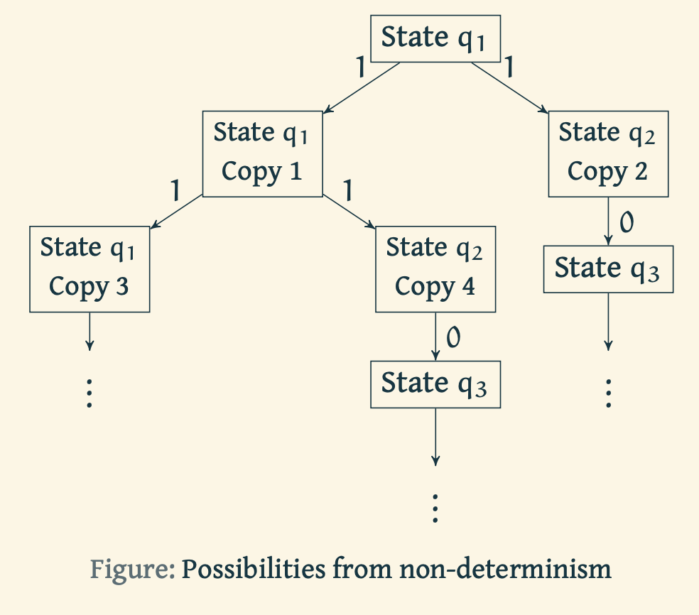

### Prerequisites

Before we start with this experiment, we recommend the reader gain an understanding of [Determininistic Finite Automata (DFA)](https://virtual-labs.github.io/exp-determinstic-finite-automaton-iiith/). 

<!-- A non-deterministic finite automaton (NFA) is an abstraction of a memory-less machine with transitions that need not be unique. A NFA either accepts or rejects a string by running through a sequence of states that are non-deterministically chosen upon reading the sequence of symbols in the given string. A language of a NFA is the set of all strings that are accepted by it. --->

# Introduction
Let us recall the following definitions.

A *Deterministic Finite State Machine* (FSM) is a $5$-tuple $(Q, \Sigma, \delta, q_0, F)$ where
- $Q$ is a finite set called *states*,
- $\Sigma$ is a finite set called *alphabet*,
- $\delta: Q\times \Sigma \rightarrow Q$ is the *transition function*,
- $q_0$ is the *start state*, and
- $F\subseteq Q$ is the set of *accept states*.

For a set $Q$, let $\mathcal{P}(Q)$ be the power set of $Q$. Let us now change this definition slightly to define Non-deterministic Finite State Automaton.

A *Non-Deterministic Finite State Machine* (FSM) is a $5$-tuple $(Q, \Sigma, \delta, q_0, F)$ where
- $Q$ is a finite set called *states*,
- $\Sigma$ is a finite set called *alphabet*,
- $\delta: Q\times (\Sigma\cup\{\varepsilon}) \rightarrow \mathcal{P}(Q)$ is the *transition function*,
- $q_0$ is the *start state*, and
- $F\subseteq Q$ is the set of *accept states*.

In other words, in a non-deterministic finite state machine, at any point there may exist several choices for the next state. Non-determinism can be viewed as a generalization of determinism and thus every deterministic finite automaton is a non-deterministic finite automaton.

Now let us look at an example of a Non-deterministic Finite State Automaton.

Using the above definition, we can express the automaton in the figure above as follows. $N= (Q, \Sigma, \delta, q_0, F)$ where
- $Q = (q_1, q_2, q_3, q_4)$
- $\Sigma = \{0,1\}$
- $\delta$ is given by

| | 0 | 1 |
| :--- | :---: | ---:|
| $q_1$ | $q_1$ | $\{q_1, q_2\}$ |
| $q_2$ | $q_2$ | |
| $q_3$ |  | $q_4$|
| $q_4$ | $q_4$ | $q_4$|

- start state $q_0$ is $q_1$ and
- accept state is $q_4$.

Note that the afore mentioned automaton does not have transitions for letter $1$ from state $q_2$ and for letter $0$ from states $q_1$ and $q_3$.

Suppose we are running the NFA on a given string and we reach a state where we have multiple possibilities to proceed. For example, from state $q_1$, we have two possibilities, either stay put at $q_1$ or transition to $q_2$. At this point machine splits into two copies and then explores all possibilities in parallel. Each copy of the machine takes one of the possibilities and continues as before. If there are subsequent choices, the machine splits again. If the next input symbol does not appear on an arrow from the current state in the state diagram (equivalently, if the corresponding cell in the transition table is empty), that copy of the machine dies, along with the branch of computation leading up to it. If any of the copies of the machine is an accept state at the end of the input, the NFA accepts the string.

Abstractly, non-determinism is parallel computation where several copies of the machine could be running concurrently. Simply put, if any of the sequences of possibilities lead us to an accept state at the end of the input, the machine accepts the string.

Going back to the example above, for a given input of $1101$, the sequence of possible states in a run of the machine that lead to an accept state are $q_1, q_1, q_2, q_3, q_4$.
